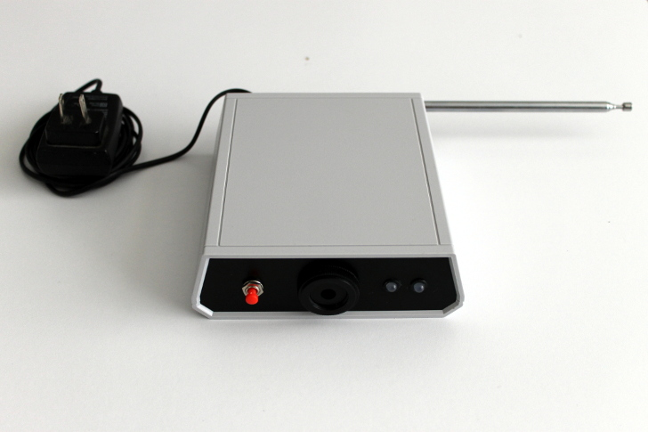
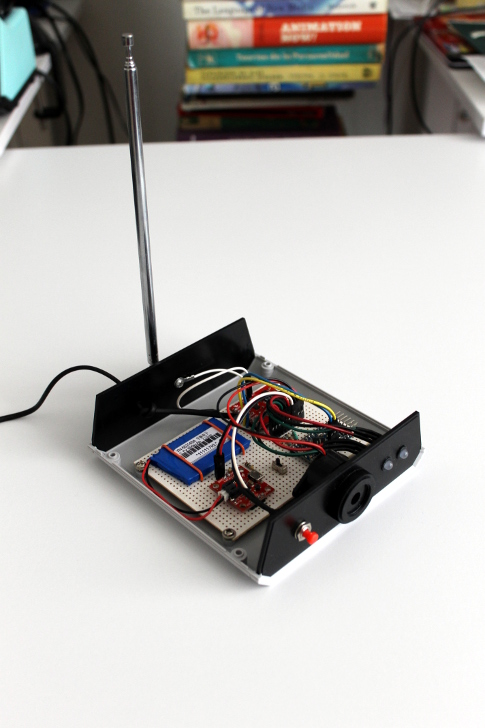
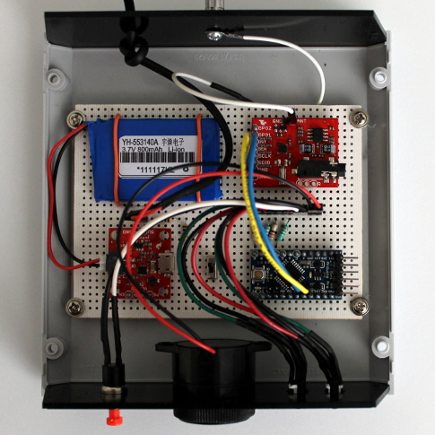
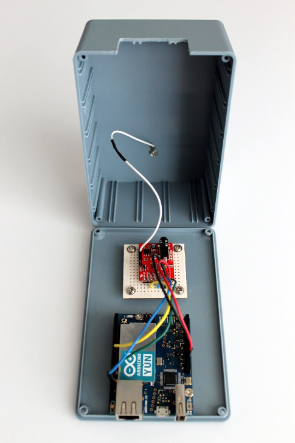

Sismo Alerta
============

Receptor libre de la señal pública del [Sistema de Alerta Sísmica
Mexicano](http://www.cires.org.mx/sasmex_es.php).

Prototipo
---------

[](https://flic.kr/p/qupofe)

[](https://flic.kr/p/pPRnoG)

[](https://flic.kr/p/qwKxXX)

Operación
---------

La interacción con el usuario es por medio de:

- Dos leds bicolor (rojo y verde) que llamaremos de energía y de señal.
- Un zumbador o buzzer.
- Un botón de usuario.

Al encender Sismo Alerta realiza una autoprueba que consiste en:

1. Encender ambos leds en color verde y activar el zumbador
2. Encender ambos leds en color rojo y desactivar el zumbador
3. Apagar ambos leds

Si después de la autoprueba se enciende el led de energía en color rojo
existe un problema interno.

Después de la autoprueba Sismo Alerta buscara el canal con mejor calidad
para monitorear la alerta sísmica. En caso de no encontrar un canal se
encenderá el led de señal en color rojo.

En caso de sintonizar un canal con éxito el led de señal encenderá
intermitentemente en color verde. Cuando Sismo Alerta reciba la prueba
periódica del Sistema de Alerta Sísmica el led de señal dejara de
parpadear y quedara encendido en color verde. El mensaje de prueba se
transmite cada 3 horas a partir de las 2:45.

En caso de recibir un mensaje de alerta sísmica ambos leds encenderán
intermitentemente en color rojo y el zumbador se activara. La duración
de la alerta es de 60 segundos.

Para probar Sismo Alerta basta con presionar el botón de usuario durante
al menos 3 segundos y se activara la alerta sísmica durante 10 segundos.

En resumen, los leds indican:

Led|Color|Significado
---|-----|-----------
Energía y Señal|Intermitente Rojo|Alerta sísmica
Señal|Intermitente Verde|Canal sintonizado, esperando prueba periódica
Señal|Verde|Canal sintonizado y prueba periódica vigente
Señal|Rojo|No hay canal sintonizado
Energía|Verde|Alimentada por la red eléctrica
Energía|Intermitente Verde|Alimentada por la batería de respaldo
Energía|Rojo|Problema interno

Funcionamiento
--------------

Sismo Alerta es posible gracias a la señal publica del Sistema de Alerta
Sísmica Mexicano operado por el [Centro de Instrumentación y Registro
Sísmico](http://www.cires.org.mx/).

La señal del Sistema de Alerta Sísmica Mexicano es de tipo
[VHF](http://en.wikipedia.org/wiki/Very_high_frequency) en los canales
de [Weather Radio](http://en.wikipedia.org/wiki/Weather_radio) y utiliza
el [protocolo
SAME](http://en.wikipedia.org/wiki/Specific_Area_Message_Encoding) para
transmitir alertas sobre distintos riesgos.

Sismo Alerta sintoniza y decodifica esta señal gracias al chip
[Si4707](http://www.silabs.com/products/audio/fm-am-receiver/pages/si4707.aspx)
que junto a una placa [Arduino](http://arduino.cc) dispara la alerta
sísmica de acuerdo al mensaje recibido. La comunicación entre el Si4707
y el microcontrolador de Arduino es posible gracias a la biblioteca
[Si4707 Arduino
Library](https://github.com/manuel-rabade/Si4707_Arduino_Library).

Hardware
--------

### Lista de partes

Cantidad | Descripción
-------- | -----------
1 | [Arduino Pro Mini 3.3 V 8 Mhz](http://arduino.cc/en/Main/ArduinoBoardProMini)
1 | [Power Cell - LiPo Charger/Booster](https://www.sparkfun.com/products/11231)
1 | [Si4707 Weather Band Receiver Breakout](https://www.sparkfun.com/products/11129)
1 | Bateria Li-Ion 3.7 V 800 mAh
1 | Zumbador
2 | Push Button normalmente abierto
2 | Led Bicolor
2 | Resistencia 33 ohm
2 | Resistencia 330 ohm
2 | Resistencia 10M ohm
1 | Antena

#### Antena

Por la frecuencia de la señal pública del Sistema de Alerta Sísmico
Mexicano es muy fácil construir o adaptar una antena que nos permita
sintonizarla, hay dos opciones:

1. Tramo de 45 cm de cable.
2. Un elemento de una _antena de conejo_.

#### Importante

- Configurar la Power Cell a 3.3 V (cortar jumper 5V y soldar 3.3V).
- Configurar Si4707 Breakout para usar una antena externa (cortar jumper
  HP y soldar EXT).

### Esquema de conexiones


Firmware
--------

Para Arduino IDE 1.5.7, la estructura de
[SismoAlerta.ino](firmware/SismoAlerta/SismoAlerta.ino) es:

- Una maquina de estados en el ciclo infinito del sketch encargada
  escaneo de canales y monitoreo de mensajes
- Una interrupción periódica que monitorea el botón de usuario,
  actualiza los leds del dispositivo y activa el zumbador.

Los parámetros de operación del firmware se puede configurar en
[SismoAlerta.h](firmware/SismoAlerta/SismoAlerta.h).

En el puerto serial se registran los eventos de Sismo Alerta, por
ejemplo:

```
SELFTEST
SCAN_START
SCAN,162400,0.00,0.00
SCAN,162425,0.00,0.00
SCAN,162450,0.00,0.00
SCAN,162475,0.00,0.00
SCAN,162500,4.13,5.50
SCAN,162525,0.00,0.00
SCAN,162550,3.38,5.00
SCAN_OK,162500
SAME_PRE_DET
SAME_HDR_DET
SAME_HDR_RDY,1
SAME_PRE_DET
SAME_HDR_DET
SAME_HDR_RDY,2
SAME_PRE_DET
SAME_HDR_DET
SAME_HDR_RDY,3
SAME_RWT
SAME,-CIV-RWT-000000+0300-1311431-XGDF/002-....
SAME_EOM_DET
SAME_PRE_DET
SAME_EOM_DET
SAME_PRE_DET
SAME_EOM_DET
SAME_PRE_DET
SAME_EOM_DET
SAME_TEST_TIMEOUT
SAME_PRE_DET
SAME_HDR_DET
SAME_HDR_RDY,1
SAME_PRE_DET
SAME_HDR_DET
SAME_HDR_RDY,2
SAME_PRE_DET
SAME_HDR_DET
SAME_HDR_RDY,3
SAME_RWT
SAME,-CIV-RWT-000000+0300-1311431-XGDF/002-...Q
```

Monitor
-------

Esta versión del Hardware utiliza un [Arduino
Yún](http://arduino.cc/en/Main/ArduinoBoardYun) para monitorear la
operación de Sismo Alerta.

[](https://flic.kr/p/qJyAiN)

### Repetidor Twitter

Esta opción del Firmware envía a un script web cada mensaje SAME
recibido. **El objetivo de esta opción no es transmitir la alerta
sísmica al público en general.**

El script [arduino.php](software/twitter/arduino.php) recibe los
mensajes SAME, los guarda en archivos de texto y los publica en Twitter
como [@SismoAlertaMX](https://twitter.com/sismoalertamx).

Para implementar el repetidor en twitter se debe:

1. Configurar en [config.php](software/twitter/config.php.sample) los
parametros para guardar y consultar los mensajes SAME además de las
llaves secretas de Sismo Alerta y Twitter.

2. En [SismoAlerta.h](firmware/SismoAlerta/SismoAlerta.h) activar la
opción `YUN_TWITTER` y configurar la URL del web service de Sismo Alerta
con su llave secreta.

Autor
-----

Manuel Rábade <[manuel@rabade.net](mailto:manuel@rabade.net)>

Licencia
--------

Esta obra está bajo una [licencia de Creative Commons
Reconocimiento-CompartirIgual 4.0
Internacional](http://creativecommons.org/licenses/by-sa/4.0/).
